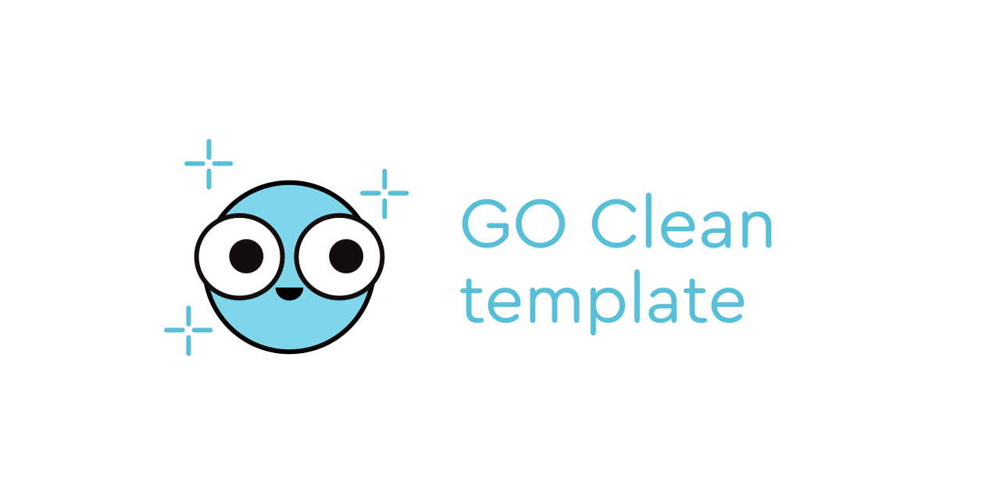

# [MCP] - Go clean-arch template

Clean Architecture template para Serviços e APIs em Golang

## Overview

Objetivo do template é mostrar uma possível organização em clean-arch para projetos que necessitem desse modelo. 

## Stack

- Go 
- Gin
- PostgreSQL
- Clean Arch
- Docker

## Project structure

### `cmd`
Inicializa os enrypoints necessários. As outras funções da aplicação continuam em `internal/`.

# desenvolvimento 
- executar o comando go mod download para baixar as dependencias
- executar o comando docker-compose up -d para subir o banco de dados
- executar o comando go run main.go para subir a aplicação
